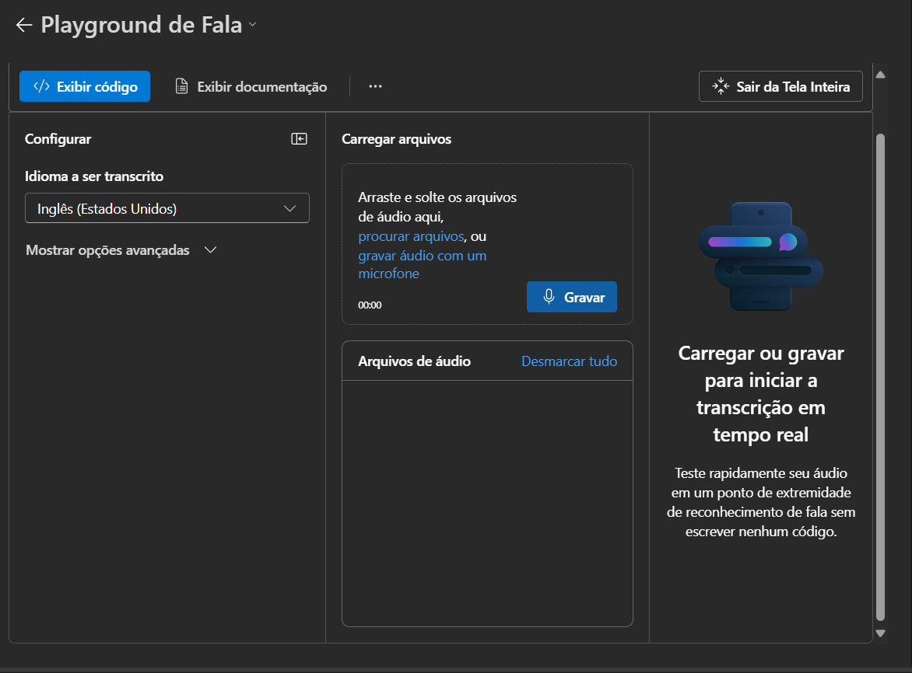

# Learning Azure Language Studio

## Azure AI Foundry:
It is a portal to assist in the development of AI agents based on Azure resources.

## Speech Playground:
A resource that works with audio-to-text conversion.
It offers several features, such as live conversation and audio transcription.

